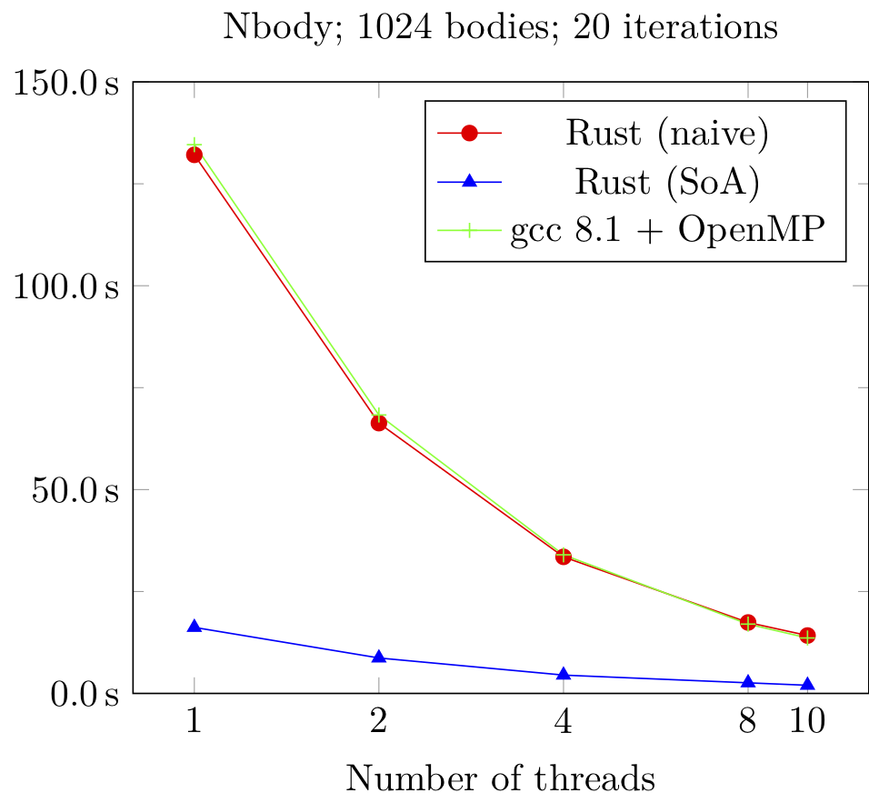

= Task- und Datenparallelität mit Rust
:revealjs_theme: solarized
// [...] other document attributes
:source-highlighter: highlightjs
:revealjs_progress: true
:revealjs_slideNumber: true
:revealjs_history: true
:highlightjs-theme: solarized-dark.css
:stem: latexmath

== !
|===
|Stefan Lankes | Jens Breitbart

| image:images/stl.png[width=100] | image:images/jbreitbart.png[width=100]

| https://github.com/stlankes[github.com/stlankes] | https://github.com/jbreitbart[github.com/jbreitbart]

| https://rwth-os.github.io/eduOS-rs/[eduOS-rs],  http://www.hermitcore.org[HermitCore] | https://www.jensbreitbart.de/[jensbreitbart.de]

| System Software @ RWTH | _Here for fun and no profit_

|===

[NOTE.speaker]
--
Stefan stellt sich vor, Jens fängt an

Nach der Vorstellung fragen:
* Wer weiß was Rust ist?
* Wer hat schonmal Rust Code gesehen?
* Wer hat versucht welchen zu schreiben?
* Wessen Code hat compiliert?
--

== Hinweise zum Vortrag

* Folien: https://stlankes.github.io/rust_parallel2019/
* Beispiele: https://github.com/stlankes/rust_parallel2019
* Einstieg: https://www.rust-lang.org
* Playground: https://play.rust-lang.org
* Tutorial: https://rustbyexample.com

[source, bash]
----
curl https://sh.rustup.rs -sSf | sh
----

[NOTE.speaker]
--
--

== Was ist Rust?

Rust ist eine (relativ) neue Programmiersprache für systemnahe Software

[source, Rust]
----
fn main() {
    // Die Statements werden ausgeführt sobald
    // das compilierte Binary gestartet wird.

    // Ausgabe auf stdout
    println!("Hello para//el 2019!");
}
----

Bekannt u.a. für den Einsatz in Firefox

=> Rust Code läuft somit auf Millionen von Rechnern

[NOTE.speaker]
--
C-Ähnliche Syntax
! ist ein Macro, aber wir tun hier so als wäre es eine Funktion
=> Eigentlich Code der Code schreibt

Nicht nur Einsatz in Firefox:
* game engines
* operating systems
* file systems
--

=== Woher kommt Rust?

image::images/rust.png[width=150]

* Rust ist ein open-source (MIT + Apache) Projekt
* Wird aktuell primär von Mozilla Research gesponsort
* Die Weiterentwicklung selbst wird allerdings stark durch die Community getrieben

[NOTE.speaker]
--
Gibt nur eine Implementierung.
LLVM Compiler
--

=== Vorteile von Rust

* C/C++ ähnliche Performance
** https://benchmarksgame-team.pages.debian.net/benchmarksgame/faster/rust-gpp.html[Link zu Vergleichsmessungen]
* Compilerbasierte Überprüfungen welche z.B.
** Speichersicherheit (ohne Garbage Collection) garantieren
** Data Races verhindern

=> _Falscher_ Code compiliert nicht

[NOTE.speaker]
--
Performance: Grundsätzlich kein Grund wieso es langsamer als C sein sollte

Link zu Computer Language Benchmarks Game
--

// === Safety vs Speed
//
// .URL: http://thoughtram.io/rust-and-nickel/#/11
// image:images/comparsion.png[jhh, width=600]
//
// [NOTE.speaker]
// --
// Die Sicht auf sich selbst. Allgemein natürlich schwierig.
// --

== Inhaltsübersicht

* Rayon
* SIMD
* Tokio.rs

Keine Einfühung zu Threads in Rust, siehe dafür z.B. https://www.heise.de/developer/artikel/Rust-als-sichere-Programmiersprache-fuer-systemnahe-und-parallele-Software-4155591.html[Heise Developer]

[NOTE.speaker]
--
Rayon, SIMD: Klassische parallelität
Tokio.rs: Nebenläufigkeit (Async I/O)

Nächste Folie: Stefan
--

== Rayon: Parallelism in Rust

* https://github.com/rayon-rs/rayon
* Unterstützt parallele Berechungen auf Basis von Task-Parallelität, Fork-Join-Prinzipien und _Work Stealing_
** Ähnlich zu Cilk (daher auch der Name)
* Bietet aber auch Daten-Parallelität über Iteratoren an

[NOTE.speaker]
--
rayon == Kunstseide
silk == Seide
Eingesetzt in firefox
Automatische Lastbalanzierung
--

=== Zielsetzung von Rayon (I)

* https://github.com/rayon-rs/rayon[Zitat:] Rayon is a data-parallelism library for Rust. It is extremely lightweight and makes it easy to convert a sequential computation into a parallel one. It also guarantees data-race freedom.
** Compiler erkennt mehrfach Benutzung
*** Es kann nur einen (Owner) geben
** Zudem müssen Datentypen als *Threadsafe* definiert werden

=== Zielsetzung von Rayon (II)

* Einführung spezieller _Traits_, um Threadsicherheit zu gewährleisten.

[source, Rust]
----
// A type is `Send` if it is safe to send it to another thread.
// A type is `Sync` if it is safe to share between threads.

fn foo<T:Send+Sync>(value: T) {
	...
}
----

// === Iteratoren in Rust
//
// * Serielle Pi-Berechnung mit Hilfe von Iteratoren
//
// [source, Rust]
// ----
// let step = 1.0 / NUM_STEPS as f64;
//
// let sum: f64 = (0..NUM_STEPS).into_iter()
//     .map(|i| {
//         let x = (i as f64 + 0.5) * step;
//         4.0 / (1.0 + x * x)
//     }).sum();
//
// println!("Pi: {}", sum * (1.0 / NUM_STEPS as f64));
// ----
//
// [NOTE.speaker]
// --
// --
//
// === Pi-Berechnung mit Rayon
//
// * Parallele Pi-Berechnung mit Rayon
// * Lohnt sich nur bei größeren Aufgaben
//
// [source, Rust]
// ----
// let step = 1.0 / NUM_STEPS as f64;
//
// let sum: f64 = (0..NUM_STEPS).into_par_iter()
//     .map(|i| {
//         let x = (i as f64 + 0.5) * step;
//         4.0 / (1.0 + x * x)
//     }).sum();
//
// println!("Pi: {}", sum * (1.0 / NUM_STEPS as f64));
// ----
//
// [NOTE.speaker]
// --
// --
//
// === Das Laplace-Problem
//
// * Wärme-Verteilung innerhalb einer Platte
// * Gelöst mit _Jacobi Over Relaxation_ (JOR)
//
// image::images/laplace.png[width=600]
//
// [NOTE.speaker]
// --
// --
//
//
// === Lösung mit Hilfe von Tasks
//
// image::images/laplace_task.png[width=600]
//
// [NOTE.speaker]
// --
// Gemessen auf Intel Haswell EP mit 10 Kernen
// --
//
// === Lösung durch eine // For-Schleife
//
// image::images/laplace_for.png[width=600]
//
// [NOTE.speaker]
// --
// Sprung bei 10 Threads verschwindet mit Threadpool
// --

=== Beispiel: N-Body

* Interative Berechnung der Gravitations- bzw. Coulomb-Kraft zwischen Partikeln im Raum.
* Kraft: latexmath:[\vec{F}(n+1)=\vec{r}(n) \cdot |\vec{r}(n)|^{-3/2}]
* Geschwindigkeit: latexmath:[\vec{v}(n+1)=\Delta t \cdot \vec{F}(n+1) + \vec{v}(n)]
* Position: latexmath:[\vec{x}(n+1)=\Delta t \cdot \vec{v}(n+1) + \vec{x}(n)]
* Nur zum Erläutern der Prinzipien
* Besser https://github.com/fbaru-dev/nbody-demo[optimierte Lösungen] verfügbar

=== N-Body

=== N-Body: Naive Lösung

* Ein Körper wird beschrieben durch seine Postion sowie seine Geschwindigkeit
* Position und Geschwindigkeit sind Vektoren im 3-dimensionalen Raum

[source, Rust]
----
#[derive(Copy, Clone, Debug)]
pub struct Vector<T> {
	pub x: T,
	pub y: T,
	pub z: T
}
----

=== N-Body: Vektor-Operationen

* Für diese Vektoren müssen die Vektor-Operation definiert werden
** Hier selber geschrieben
** Standard-Implementierungen (z.B. https://github.com/rustgd/cgmath[cgmath]) sind verfügbar

[source, Rust]
----
/// Definition des Operators +=
impl<T: Add<Output=T> + AddAssign> AddAssign for Vector<T> {
	fn add_assign(&mut self, other: Vector<T>) {
		self.x += other.x;
		self.y += other.y;
		self.z += other.z;
	}
}
----

=== N-Body: Vektor-Operationen

* Die Körper werden durch ein zusammenhängender, erweiterbarer Feld-Typ, `Vec<T>` beschrieben.
* Teil der Standard-Laufzeitumgebung

[source, Rust]
----
#[derive(Clone, Debug, PartialEq)]
pub struct NBody {
	pub position: Vec<Vector<Precision>>,
	pub velocity: Vec<Vector<Precision>>
}
----

=== N-Body: Algorithmus

* Abstand zwischen allen Körper bestimmen
* Kraft herleiten, Geschwindigkeit und Position neu bestimmen

[source, Rust]
----
position.iter().zip(velocity.iter_mut())
  .for_each(|(item_pi, item_vi)| {
	let mut f: Vector<Precision> = Vector::new(0.0, 0.0, 0.0);

	position.iter().for_each(|item_pj| {
		// Newton’s law of universal gravity calculation.
		let diff = *item_pj - *item_pi;
		let n2 = diff * diff;
		let power = 1.0 / (n2.sqrt() * n2);
		f += diff*power;
	});
	*item_vi += f*DELTA_T;
});
----

=== N-Body: Trick

* 2 Iteratoren über die Geschwindigkeit und Position im Gleichschritt bewegen => `zip`-Operator in Rust

[source, Rust]
----
position.iter().zip(velocity.iter_mut())
  .for_each(|(item_pi, item_vi)| {
	let mut f: Vector<Precision> = Vector::new(0.0, 0.0, 0.0);

	position.iter().for_each(|item_pj| {
		// Newton’s law of universal gravity calculation.
		let diff = *item_pj - *item_pi;
		let n2 = diff * diff;
		let power = 1.0 / (n2.sqrt() * n2);
		f += diff*power;
	});

	*item_vi += f*DELTA_T;
});
----

=== Parallelisierung mit Rayon

* Definition von parallelen Itertoren (ähnlich zu https://www.threadingbuildingblocks.org[TBB])
* Stehen für alle Algorithem aus der Standardumgebung zur Verfügung

[source, Rust]
----
position.par_iter().zip(velocity.par_iter_mut())
  .for_each(|(item_pi, item_vi)| {
	let mut f: Vector<Precision> = Vector::new(0.0, 0.0, 0.0);

	position.iter().for_each(|item_pj| {
		// Newton’s law of universal gravity calculation.
		let diff = *item_pj - *item_pi;
		let n2 = diff.square();
		let power = 1.0 / (n2.sqrt() * n2);
		f += diff*power;
	});
	*item_vi += f*DELTA_T;
});
----

=== Array of Structures

* Bisherige Lösung ist anschaulich, aber nicht für SIMD geeignet
* Einzelne Komponenten (z.B. alle `x`-Einträge) liege nicht kontinuierlich im Speicher
* Alignment nicht zwingend garantiert
* *Idee:* Structure of Arrays

[source, Rust]
----
#[derive(Clone, Debug, PartialEq)]
pub struct NBody {
	pub position: Vec<Vector<Precision>>,
	pub velocity: Vec<Vector<Precision>>
}
----

=== Structure of Arrays

* Statt je Körper eine Struktur in einem Array abzulegen, wird eine Struktur von Arrays angelegt
** Mögliche Optimierung von Vektor-Operationen
* Typische Lösung in C

[source, C]
----
typedef float Scalar;

typedef struct {
	Scalar x[nParticles];
	Scalar y[nParticles];
	Scalar z[nParticles];
	Scalar vx[nParticles];
	Scalar vy[nParticles];
	Scalar vz[nParticles];
} NBody;
----

== SIMD-Programmierung

* Mögliche Lösungen (allgemein)
** Optimierungen durch den Compiler (häufig nicht optimal)
** Hinweise an den Compiler (z.B. OpenMP)
** Direkte Programmierung durch Intrinsics

[source, C]
----
// Entspricht direkter Assembler-Progrommierung
__m256 _mm256_add_ps (__m256 a, __m256 b);
----

=== `packed_simd`

* Portable SIMD-Vektoren durch https://github.com/rust-lang-nursery/packed_simd[`packed-simd`]
* Zurzeit nur mit dem `nightly`-Compiler verwendbar
* Einführung neuer Typen, welche SIMD-Register entsprechen
* Standard-Operatoren existieren bereits für diese Typen

[source, Rust]
----
// Vektor-Addition mit 8 einfach, genaue Fließkommazahlen
pub fn sum(a: f32x8, b: f32x8) -> f32x8 {
	a+b
}
----

=== Structure of Arrays in Rust

* `T` ist hier ein SIMD-Datentyp (z.B. `f32x8`)
* Es fehlt ein Iterator, um parallel über `x`, `y` und `z` zu wandern

[source, Rust]
----
pub struct Array<T>([T; N_PARTICLES_SOA]);

pub struct StructOfArrays<T> {
	pub x: Array<T>,
	pub y: Array<T>,
	pub z: Array<T>
}

pub struct NBodySoA {
	position: StructOfArrays<PrecisionSoA>,
	velocity: StructOfArrays<PrecisionSoA>
}
----

=== Neuer Iterator

* Aktuelle Position (`pos`) festhalten und auswerten

[source, Rust]
----
pub struct StructOfArraysIter<'a, T: 'a> {
	inner: &'a StructOfArrays<T>,
	pos: usize, len: usize
}

impl<'a, T> Iterator for StructOfArraysIter<'a, T> {
	type Item = (&'a T, &'a T, &'a T);
	fn next(&mut self) -> Option<Self::Item> {
		if self.pos < self.len {
			let result = (&self.inner.x.0[self.pos],
				      &self.inner.y.0[self.pos],
				      &self.inner.z.0[self.pos]);
			self.pos += 1;
			Some(result)
	} } }
----

=== Anpassung des Algorithmuses

* Iteratoren liefern nun `(x, y, z)` zurück.

[source, Rust]
----
position.iter().zip(velocity.iter_mut())
  .for_each(|((pix, piy, piz), (vix, viy, viz))| {
	let mut fx: PrecisionSoA = ...
	position.iter().for_each(|(pjx, pjy, pjz)| {
		let mut dx: ...
		for lane in 0..PrecisionSoA::lanes() {
			dx +=  *pjx - PrecisionSoA::splat(pix.extract(lane));
			dy +=  ..
		}
		let n2 = dx*dx + dy*dy + dz*dz;
		let power = 1.0 / (n2.sqrt() * n2);
		fx += dx*power; fy += dy*power; fz += dz*power;
	});
	*vix += fx * dt; *viy += fy * dt; *viz += fz * dt;
});
----

=== Paralleler Algorithmus

* Parallele Iteratoren existiert nicht für eigene Iteratoren
* Lösung:
** Selber definieren
** Oder aus _sequentielle_ Iteratoren ableiten
*** Eventuell sind diese nicht optimal

[source, Rust]
----
position.iter().zip(velocity.iter_mut()).par_bridge()
  .for_each(|((pix, piy, piz), (vix, viy, viz))| {
	..
}
----

// === Resultierenden Geschwindigkeit
//
// [source, C]
// ----
// void nbody_velocity_update_core(ParticleSystem * const s,
// 	const Index i) {
// 	float Fx = 0.0f; float Fy = 0.0f; float Fz = 0.0f; // Components of force
// 	for (Index j = 0; j < nParticles; j++)	{ // Vectorized loop over particles
// 		if (j != i) {
// 			// Newton’s law of universal gravity calculation.
// 			const float dx = s->x[j] - s->x[i];
// 			const float dy = s->y[j] - s->y[i];
// 			const float dz = s->z[j] - s->z[i];
// 			const float drSquared = dx*dx + dy*dy + dz*dz;
// 			const float drPowerN32 = 1.0f/(drSquared*sqrtf(drSquared));
// 			// Reduction to calculate the net force
// 			Fx += dx * drPowerN32; Fy += dy * drPowerN32; Fz += dz * drPowerN32;
// 		}
// 	}
// 	s->vx[i] += dt*Fx; s->vy[i] += dt*Fy; s->vz[i] += dt*Fz; // Move particles
// }
// ----
//
// === Berechnung der Position
//
// [source, C]
// ----
// void nbody_position_update_core(ParticleSystem * const s,
// 	const Index i) {
// 	s->x[i] += s->vx[i]*dt;
// 	s->y[i] += s->vy[i]*dt;
// 	s->z[i] += s->vz[i]*dt;
// }
// ----
//
// === Parallelisierung mit Hilfe von OpenMP
//
// [source, C]
// ----
// for (Index step = 1; step<nSteps; ++step)
// {
// 	#pragma omp parallel for schedule(dynamic)
// 	for (Index i = 0; i < nParticles; i++) { // Parallel loop over particles
// 		nbody_velocity_update_core(&particles, i);
// 	}
//
// 	// fork-join model => implicit barrier
//
// 	for (Index i = 0 ; i < nParticles; i++) { // Not much work, serial loop
// 		nbody_position_update_core(&particles, i);
// 	}
// }
// ----

// == Weitere Hinweise
//
// Mal schauen ob wir das hier brauchen
// *  [T]::split_at_mut() oder [T]::chunks() um gemeinsame Datenstrukturen aufzuteilen für den borrow checker

=== Performance / Traue keiner Statistik

== tokio.rs

* Eine Bibliothek für Nebenläufigkeit
** basierend auf `Futures`
** und einer Laufzeitumgebung
* Anwendungsgebiet: asynchrones I/O
* link:https://tokio.rs/[Link]

[NOTE.speaker]
--
Rusts Lösung für das 'C10K Problem'
Idee: Man baut eine State Machine über Futures auf und die Laufzeitumgebung arbeitet sie ab.
Achtung: Sieht alles funktional aus!
--

=== Laufzeitumgebung

* Multithreaded + work stealing
** Multiplexing
* Futures sind `poll`-basiert
** Backpressure im allgemeinen kein Problem
** Unnötige Futures werden automatisch verworfen und erzeugen keine Last

[NOTE.speaker]
--
Aufräumen im allgemeinen nur für ressourcen
--

=== Beispiel: Client / Server

* Einfacher TCP Client und Server
** Client sendet viele Anfragen parallel
** Server sendet empfangene Daten wieder zurück
* Idee
** Eine Task pro Anfrage
** Wechsel der Task, wenn sie nichts tun kann

=== Server (i)

* Unendlicher Stream an Verbindungen

[source, Rust]
----
let listener = TcpListener::bind(&addr).unwrap();
let server = listener
    .incoming()
    .for_each(|socket| {
        // für jede Verbindung
        // siehe nächste Folie
    })
    .map_err(|err| {
        // Fehlerbehandlung
        println!("accept error = {:?}", err);
    });
tokio::run(server);
----

[NOTE.speaker]
--
listener teil von tokio, aber nicht blockierend
server ist unendlicher stream, ein eintrag pro Verbindung
tokio::run startet die laufzeitumgebung
--

=== Server (ii) - pro Verbindung

* Wird ausgeführt sobald eine Verbindung aufgebaut wurde
[source, Rust]
----
let (reader, writer) = socket.split();
let amountF = io::copy(reader, writer);

let msg = amountF.then(|result| {
    match result {
        Ok((amount, _, _)) => println!("wrote {} bytes", amount),
        Err(e) => println!("error: {}", e),
    }

    Ok(())
});

tokio::spawn(msg);
Ok(())
----

[NOTE.speaker]
--
Code für das TODO, also pro Verbindung
Socket Verbindung ist echt da, split sofort
Rest futures
--

=== Client (i) - Server Verbindung

* Future für das Versenden von "hello para//el"
[source, Rust]
----
TcpStream::connect(&addr)
    .and_then(|stream| {
        println!("connected");

        io::write_all(stream, "hello para//el\n").then(|result| {
            println!("wrote to connection; success={:?}",
                     result.is_ok());
            Ok(())
        })
    })
    .map_err(|err| {
        println!("connection error = {:?}", err);
    })
----

[NOTE.speaker]
--
Unterschied then/and_than -> andere kombinatoren!
and_then nur wenn kein fehler
--

=== Client (ii) - Fehlerbehandlung

* Retry mit exponential backoff

[source, Rust]
----
let number_of_connections = 100_000;
let retry_strategy = ExponentialBackoff::from_millis(10)
                     .map(jitter).take(3);

let client = stream::iter_ok(0..number_of_connections)
    .for_each(move |_| Retry::spawn(
        retry_strategy.clone(),
        action
    ).then(|_| Ok(())));
----

[NOTE.speaker]
--
--

=== Performance

* Es passiert nicht viel in dem Beispiel
* Die meiste Zeit wird im OS verbracht (oder gewartet)
* Linux Desktop (Ryzen 2700X): ~33.000 Verbindungen pro Sekunde
** <25% last auf allen 16 Kernen

=== Ausblick Nebenläufigkeit

* link:https://github.com/rust-lang/rfcs/pull/2394[RFC #2394] async / await als Teil der Sprache

[source, Rust]
----
fn main() {
    let closure = async || {
         println("Hello from async closure.");
    };
    println!("Hello from main");
    let future = closure();
    println!("Hello from main again");
    futures::block_on(future);
}
----
[NOTE.speaker]
--
Code:
2 x "Hello from main"
"Hello from async closure."
--

== Zusammenfassung

* Rust ist für einen _old school_ Entwickler gewönnungsbedürftig
* Rayon und Tokio vereinfachen viele Aufgaben
* `packed-simd` emöglicht eine transparente Verwendung von Vektorregister
* Performance ist im allgemeinen sehr gut

[NOTE.speaker]
--
--
